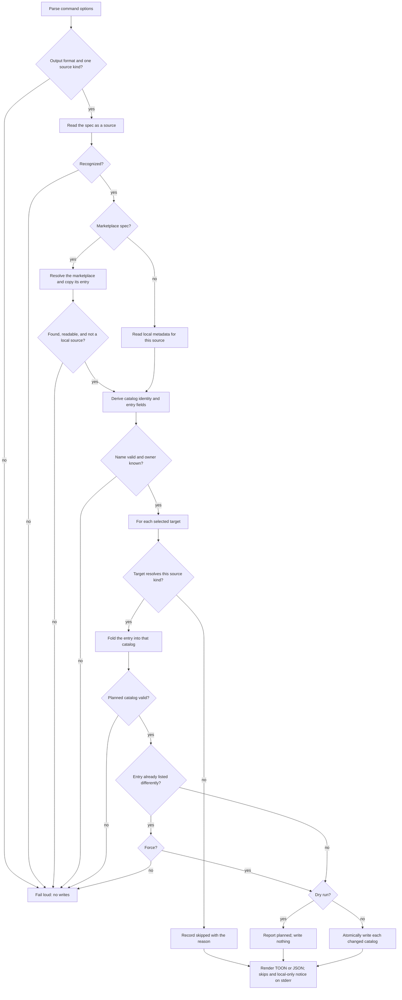

# marketplace add — list a plugin that lives elsewhere

## What

`universal-plugin marketplace add` writes a catalog entry for a plugin the repository does not hold.
It gives a maintainer a repeatable way to curate a marketplace — a repository whose job is the list
itself — without hand-authoring the JSON each runtime loads.

It is the sibling of [`init/`](../init/README.md), which derives entries from the plugins a
repository **does** hold. Both write the same catalog files and neither publishes anything. One
repository may use both: a regeneration keeps what `add` wrote, because discovery could not have
produced it.

The command is a **local derivation**. It reads the repository selected by `--root`, and at most one
marketplace already installed on this machine, and writes only catalog files. Nothing is fetched.

**Non-goals:** fetching plugin metadata from a registry or a forge; publishing or registering a
marketplace; installing a plugin; authenticating or provisioning; verifying that a remote source
resolves to a real plugin.

## Use Cases

| Entry point | Trigger | Inputs | Outcome |
|---|---|---|---|
| `marketplace add <path>` | A maintainer lists a plugin held outside the scan roots. | A `./`-prefixed path, or any path with `--path`. | Every selected catalog gains an entry whose source is that path. |
| `marketplace add npm:<pkg>` | A plugin is distributed through npm. | A package name. | Claude and Codex gain an npm entry; Copilot and Cursor are skipped. |
| `marketplace add <owner>/<repo>` | A plugin is distributed from a forge. | An `owner/repo` slug or a git URL. | Claude gains the entry; the other three are skipped. |
| `marketplace add <plugin>@<marketplace>` | A maintainer re-lists a plugin another marketplace publishes. | An installed marketplace, or `--from <dir>`. | The copied entry's own source and metadata are written. |
| `marketplace add … --dry-run` | A maintainer reviews the entry and the skips. | Any spec plus `--dry-run`. | The plan is reported and no catalog changes. |
| `marketplace add … --force` | A maintainer replaces an entry already listed differently. | A conflicting entry name plus `--force`. | Only that entry is replaced. |
| `marketplace add … --format json` | A script consumes the result. | `--format json`. | stdout is a machine-readable row list; diagnostics stay on stderr. |

### Spec reading decisions

- A spec is read by shape, in this order: an `npm:` prefix; a URL scheme or an `scp`-style
  `git@host:path`; a path, which must announce itself with `./`, `../`, or a leading slash;
  `<plugin>@<marketplace>`, split at the first `@` that is not a leading scope marker; `owner/repo`;
  anything remaining that is a valid package name.
- `--path`, `--npm`, `--github`, `--url`, and `--from-marketplace` each force the reading. More than
  one is an error rather than a precedence rule.
- `plugins/alpha` therefore reads as a GitHub repository. Reaching for the filesystem to decide would
  make the same string mean different things in different working directories.
- A leading `@` is a scope: `@scope/pkg` is a package, `pkg@mkt` is a marketplace entry, and
  `@scope/pkg@mkt` is the latter.
- The entry name is the package name without its scope, the repository name, the last path segment,
  or the plugin half of a marketplace spec. `--name` overrides it, and every name must match the
  catalog name grammar.
- A spec matching no rule fails naming the flags that would settle it.

### Source and target decisions

- Every runtime installs from a repository path. Beyond that: Claude Code accepts the schema's full
  tagged set (`npm`, `github`, `url`, `git-subdir`), Codex accepts `npm`, and Copilot CLI and Cursor
  accept neither.
- A selected target that cannot resolve the source is reported `skipped` with the reason and no file
  is written for it. Writing a source a runtime refuses moves the failure to install time, in
  another user's terminal.
- With no target flags, all four are selected, so skipping is the ordinary outcome for a non-local
  source rather than an error.

### Metadata decisions

- An entry carries the same fields a discovered entry carries: `description`, `version`, `homepage`,
  `repository`, `license`, `keywords`.
- Values come from what is already on the machine — a path source's own `plugin.json`, an installed
  `node_modules/<pkg>/package.json`, or the copied marketplace entry — and the corresponding flags
  override them. A field with no value is omitted; an entry missing an optional field still installs.
- Nothing is fetched from a registry or a forge.

### Marketplace resolution decisions

- The catalog schema states no source for "a plugin in another marketplace", so the entry is resolved
  and copied rather than referenced.
- The marketplace is found among those the runtime has already added, read from the user's Claude
  plugins home; `--from <dir>` names a checkout when it is not installed. A marketplace resolving to
  neither stops the command.
- A marketplace that carries no `marketplace.json`, a catalog that is not JSON, a plugin the catalog
  does not list, and an entry naming no source each stop the command with a message naming the cause.
- An entry whose source is local is refused: it resolves against that marketplace's root, which this
  repository is not.

### Write and safety decisions

- The catalog's other entries, its top-level fields, and its key order survive. Only this entry is
  written.
- Unlike a re-derivation, this command replaces a non-local source, because a new source is what it
  was asked for.
- A catalog the repository does not carry is created, named and owned the way `init` names it, with
  `--marketplace-name` and `--owner` overriding. A missing owner stops the command before any write.
- An entry of this name already listed with different content stops the whole command with a
  `--force` remedy. An entry that would say exactly what is already there is `unchanged`.
- Every planned catalog is checked against the schema its runtime loads before anything is written.
- `--dry-run` writes nothing. Each changed catalog is written atomically.
- Every row carries `target`, `status`, `entry`, `source`, and `path`, with an optional `reason`.
  Status is one of `added`, `updated`, `unchanged`, `planned`, or `skipped`.
- Default output is a compact TOON table on stdout; `--format json` returns the same rows. stderr
  carries each skip and a reminder that no remote marketplace action occurred.

## Control Flow

## Scenario map

### `marketplace add` — reading the spec

| Edge | Path (Given) | Scenario |
|---|---|---|
| path source | a `./`-prefixed path | `a path source reaches every runtime` |
| npm source | an `npm:`-prefixed package | `an npm source reaches the runtimes that install from npm` |
| github source | an `owner/repo` slug | `a forge source reaches the runtime that resolves it` |
| url source | an https or scp-style git URL | `a git URL is read as a url source` |
| scope not separator | a scoped package name | `a leading scope marker is not a marketplace separator` |
| marketplace spec | `<plugin>@<marketplace>` | `a marketplace spec names an entry to copy` |
| path must announce | a bare `a/b` string | `an unannounced path reads as a forge slug` |
| explicit kind | a spec plus a kind flag | `an explicit kind overrides the guess` |
| two kinds | two kind flags | `more than one source kind fails before writes` |
| unreadable spec | a spec matching no rule | `an unrecognized spec names the flags that settle it` |
| name override | `--name` supplied | `an explicit entry name overrides the derived one` |
| name grammar | a derived name violating the grammar | `an invalid entry name fails before writes` |

### `marketplace add` — sources, targets, and metadata

| Edge | Path (Given) | Scenario |
|---|---|---|
| unsupported skip | an npm source with every target selected | `a target that cannot resolve the source is skipped with its reason` |
| no write on skip | a skipped target | `a skipped target's catalog is not written` |
| manifest metadata | a path source whose plugin.json carries fields | `a path source takes its metadata from the plugin manifest` |
| installed package | an npm source present in node_modules | `an installed package supplies its own metadata` |
| flags win | supplied metadata and discovered metadata disagree | `a metadata flag overrides what was discovered` |
| no fetch | an npm source absent from node_modules | `an unknown package is listed with what the flags supply` |

### `marketplace add` — resolving another marketplace

| Edge | Path (Given) | Scenario |
|---|---|---|
| installed resolution | the marketplace is installed in the runtime | `an installed marketplace resolves without a network call` |
| from override | the marketplace is not installed; `--from` given | `--from names a marketplace that is not installed` |
| unknown marketplace | neither installed nor `--from` | `an unresolvable marketplace fails before writes` |
| missing entry | the catalog lists no such plugin | `a plugin the marketplace does not list fails before writes` |
| local source refusal | the copied entry's source is a local path | `a local source in another marketplace is refused` |

### `marketplace add` — writes and rendering

| Edge | Path (Given) | Scenario |
|---|---|---|
| catalog creation | the repository carries no catalog | `a repository with no catalog gets one` |
| owner guard | no root author and no `--owner` | `a missing marketplace owner fails before writes` |
| entry preserved | a catalog already carrying other entries | `other entries and the catalog top level survive` |
| convergence | the entry already says exactly this | `an equivalent rerun is unchanged` |
| conflict guard | the entry is listed differently; no `--force` | `a differing entry fails without changing any catalog` |
| force branch | the entry is listed differently; `--force` | `force replaces the entry` |
| dry-run branch | any spec plus `--dry-run` | `dry run reports the plan without writing it` |
| composition | an added entry, then `marketplace init --force` | `an added entry survives a regeneration` |
| default rendering | a successful invocation | `default output is TOON and states the local-only boundary` |
| JSON rendering | `--format json` | `JSON output exposes the result rows` |
| output validation | unsupported `--format` value | `an unsupported output format fails loud before writes` |
