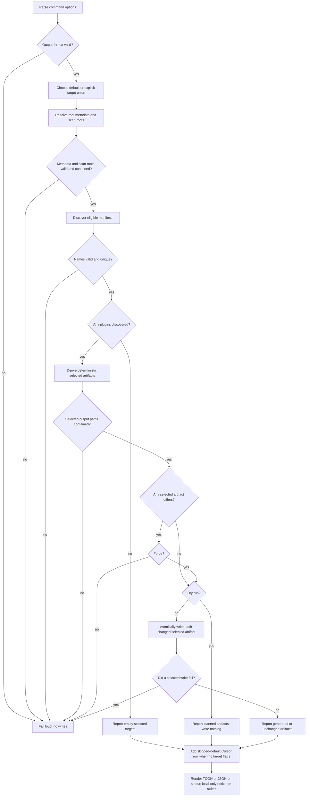

# marketplace init — derive local marketplace metadata

## What

`universal-plugin marketplace init` turns the plugin manifests already present in a repository into
vendor-specific marketplace metadata. It gives a repository maintainer a repeatable, reviewable way
to prepare local catalogs without handing any repository content to a marketplace service.

The command is a **local derivation**: it reads only the repository selected by `--root` and writes
only its generated metadata. A **catalog** is a vendor's local JSON list of plugins and their
repository-relative sources. A **submission scaffold** is local JSON plus a handoff document; it is
not a submission.

A **marketplace manifest** is a top-level plugin.json used only by this command for marketplace
metadata. It is independent of the canonical .plugin/plugin.json agent-plugin manifest: a repository
may carry either or both, and this command does not read or validate the canonical manifest.

**Non-goals:** publishing or registering a marketplace; installing a plugin; authenticating,
provisioning, or managing tokens; calling a marketplace API; automating a vendor dashboard; or
proving a discovered plugin will install successfully in every vendor runtime.

## Use Cases

| Entry point | Trigger | Inputs | Outcome |
|---|---|---|---|
| `marketplace init` | A maintainer prepares the normal local catalogs. | `--root`, optionally `--name` and `--owner`. | Claude, Codex, and Copilot catalogs are derived; Cursor is reported as not selected by default. |
| `marketplace init --claude --codex --copilot --cursor` | A maintainer prepares a selected target set. | One or more target flags. | Exactly the selected targets are planned or generated; Cursor receives a local submission scaffold only when selected. |
| `marketplace init --plugin-scan-dir <dir>` | A repository keeps plugins outside the default scan directory. | One or more root-relative scan directories. | Only eligible root-level manifests under those directories are discovered; an invalid requested directory stops before writes. |
| `marketplace init --dry-run` | A maintainer reviews a proposed generation. | Any target, discovery, and metadata options plus `--dry-run`. | The complete write plan is reported and no generated artifact changes. |
| `marketplace init --force` | A maintainer intentionally replaces differing selected metadata. | A selected target whose generated artifact differs, plus `--force`. | Only the selected differing artifacts are replaced after preflight succeeds. |
| `marketplace init --format json` | A script consumes the generation result. | `--format json`. | stdout is a machine-readable result list; diagnostics remain on stderr. |

### Target and discovery decisions

- With no target flags, the target set is Claude, Codex, and Copilot. Cursor is reported as
  `skipped-default`, because it requires an explicit submission handoff.
- Target flags compose as a union. A target is never generated merely because a different target was
  selected.
- The default discovery root is the root's plugins directory. Its absence is a successful empty discovery.
  Every explicit `--plugin-scan-dir` must exist, be a directory, and resolve within `--root`.
- A candidate is a marketplace manifest at scan-root/direct-child/plugin.json. Nested plugin.json
  files do not expand the scan boundary. The canonical .plugin/plugin.json and vendor-owned manifest
  directories (`.claude-plugin`, `.codex-plugin`, `.cursor-plugin`) are never candidates.
- A selected scan root and every direct-child plugin directory are resolved through symbolic links
  before discovery. The candidate manifest file is resolved too. Any link resolving outside `--root`
  fails before any write.
- Every candidate manifest must be a JSON object with a required `name` string matching
  `^[A-Za-z0-9][A-Za-z0-9._-]*$`. That name is the plugin identity and the `name` emitted in catalog
  entries; names must be unique across all selected scan roots. Marketplace name defaults to the root
  directory name and follows the same grammar. Owner defaults to the root plugin.json `author` string
  (or its `author.name`); `--name` and `--owner` override those defaults, and a missing or blank owner
  stops before writes.

### Generation and safety decisions

- Claude writes its marketplace.json in .claude-plugin as `{ name, owner, plugins }`, where every
  plugin is `{ name, source }`. Copilot writes its marketplace.json in .github/plugin as
  `{ name, owner, metadata: { displayName }, plugins }`, with the same `{ name, source }` plugin
  entries. Every source is a `./`-prefixed repository-relative string.
- Codex writes its catalog in .agents/plugins as `{ name, interface: { displayName }, plugins }`.
  Each plugin is `{ name, source, policy, category }`, where
  `source` is `{ source: "local", path: "./…" }`, `policy` is
  `{ installation: "AVAILABLE", authentication: "ON_INSTALL" }`, and `category` is
  `"Productivity"`.
- Cursor writes a marketplace-submission.json file in .cursor-plugin as
  `{ name, owner, dashboard: "https://cursor.com/dashboard", plugins }`, with `{ name, source }`
  plugin entries. It also writes a CURSOR_MARKETPLACE_SUBMISSION.md handoff at the repository root.
- Catalog sources are `./`-prefixed paths relative to `--root`.
- Generation is deterministic: candidates sort by plugin name and equivalent existing JSON is
  `unchanged` regardless of object-key order or whitespace.
- The command validates metadata and plans every selected artifact before changing any of them. A
  differing selected artifact stops the whole command with a `--force` remedy. `--force` replaces
  only selected artifacts; `--dry-run` always writes nothing. Each selected artifact is written
  atomically. If a later selected write fails, the command reports the error and exits non-zero; it
  does not claim cross-artifact rollback.
- A selected artifact path and every existing parent segment are resolved through symbolic links
  before staging. A link resolving outside `--root` fails before an artifact is staged or written.
- Every result row contains `target`, `status`, `paths`, and `plugins`, with an optional `reason`.
  Status is one of `generated`, `unchanged`, `planned`, `empty`, or `skipped-default`.
- Default output is a compact TOON table on stdout. `--format json` returns the same rows as JSON.
  stderr contains errors and a clear reminder that no remote marketplace action occurred.

## Control Flow

All entry points enter the same derivation graph; flags only choose the target set, discovery roots,
write mode, and output rendering.

## Scenario map

### `marketplace init` — target selection and discovery

| Edge | Path (Given) | Scenario |
|---|---|---|
| default targets | no target flags; eligible plugins exist | `default initialization generates the three catalog targets` |
| Claude shape | Claude is selected; eligible plugins exist | `the Claude catalog records marketplace ownership and local plugin sources` |
| Codex shape | Codex is selected; eligible plugins exist | `the Codex catalog records its display name and local availability policy` |
| Copilot shape | Copilot is selected; eligible plugins exist | `the Copilot catalog records marketplace display metadata and local plugin sources` |
| explicit target union | Claude and Copilot flags selected | `explicit selectors generate exactly their union` |
| Cursor opt-in | Cursor flag selected; eligible plugins exist | `explicit Cursor selection creates only a local submission scaffold` |
| Cursor shape | Cursor is selected; eligible plugins exist | `the Cursor submission JSON identifies the marketplace and dashboard` |
| default discovery empty | default plugins directory absent | `a missing default scan directory is an empty success` |
| explicit root guard | requested scan directory escapes `--root` | `an out-of-root explicit scan directory fails before writes` |
| explicit root existence | requested in-root scan directory is absent | `a missing explicit scan directory fails before writes` |
| scan-root link guard | requested scan directory is a link outside `--root` | `an external scan-root symlink fails before writes` |
| plugin-root link guard | a direct-child plugin directory is a link outside `--root` | `an external plugin-directory symlink fails before writes` |
| manifest link guard | a candidate manifest is a link outside `--root` | `an external candidate-manifest symlink fails before writes` |
| explicit scan union | two explicit scan roots each contain an eligible plugin | `repeated scan roots contribute their plugin union` |
| metadata defaults | root name and author are available | `marketplace metadata uses the root name and author by default` |
| object-author default | root author is an object with `name` | `an object-form root author supplies the default owner` |
| metadata override | explicit name and owner are supplied | `explicit marketplace metadata overrides the defaults` |
| owner guard | no root author and no `--owner` | `a missing marketplace owner fails before writes` |
| derived-name guard | the root directory name violates the allowed grammar | `an invalid derived marketplace name fails before writes` |
| name override guard | `--name` violates the allowed grammar | `an invalid marketplace name override fails before writes` |
| owner override guard | `--owner` is blank | `a blank marketplace owner override fails before writes` |
| candidate filter | selected scan root contains ordinary and vendor-owned manifests | `only eligible plugin-root manifests become catalog entries` |
| scan-depth guard | a plugin directory contains a nested plugin.json | `a nested manifest is not a catalog candidate` |
| deterministic source list | two eligible manifests have reverse lexical discovery paths | `catalog entries are name-sorted with root-relative sources` |
| JSON validation | an eligible manifest is malformed JSON | `a malformed candidate manifest fails before writes` |
| name validation | an eligible manifest name violates the allowed grammar | `an invalid candidate name fails before writes` |
| identity uniqueness | two eligible manifests share a name | `duplicate plugin identities fail before writes` |

### `marketplace init` — planning and writes

| Edge | Path (Given) | Scenario |
|---|---|---|
| dry-run branch | selected targets have eligible plugins; `--dry-run` | `dry run reports every selected artifact without writing it` |
| equivalent convergence | selected artifacts contain semantically equivalent JSON | `an equivalent rerun is unchanged` |
| conflict guard | a selected artifact differs; no `--force` | `a differing selected artifact fails without changing any selected artifact` |
| force branch | a selected artifact differs; `--force` | `force replaces only selected differing artifacts` |
| write-error branch | a selected artifact write fails | `a selected-artifact write failure reports an error` |
| output link guard | selected output parent is a link outside `--root` | `an external selected-output symlink fails before writes` |
| output file-link guard | selected output file is a link outside `--root` | `an external selected-output file symlink fails before writes` |

### `marketplace init` — result rendering

| Edge | Path (Given) | Scenario |
|---|---|---|
| default rendering | successful default invocation | `default output is TOON and states the local-only boundary` |
| JSON rendering | successful invocation with `--format json` | `JSON output exposes the result rows` |
| output validation | unsupported `--format` value | `an unsupported output format fails loud before writes` |
