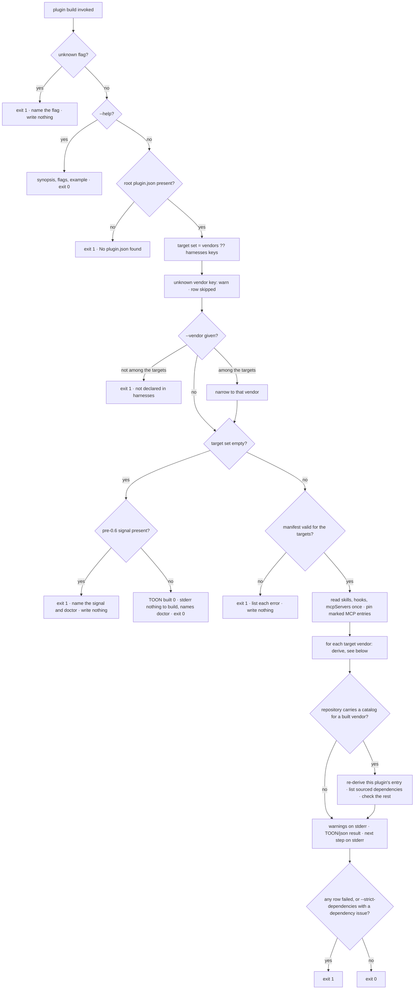
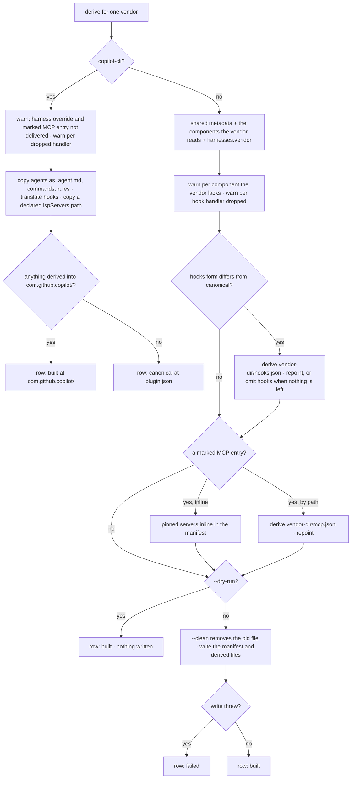

# plugin build — derive per-vendor manifests

## What

`universal-plugin plugin build` compiles the canonical root `plugin.json` (Agent Plugins Specification
v1.0.0 form) into one vendor-specific manifest per target vendor. Each vendor expects its manifest at
a different path and shape; maintaining one file per vendor lets shared fields drift. Build treats the
canonical manifest as the single source of truth and generates the rest, merging each vendor's
`extensions["org.cyberuni.universal-plugin"].harnesses.<vendor>` fields over the shared metadata and
component paths (harness wins on conflict). The canonical wrapper (`$schema`, `extensions`) and
`universal-plugin`'s own orchestration keys (`vendors`, `packagePath`, `harnesses`) never appear in a
derived manifest.

Build is the **dev-consumable** derivation — it runs constantly while authoring a plugin, is
deterministic, and needs no network. Producing the **release form** — pinning the `npx <cli>@<version>`
references a plugin's skills carry to the versions being shipped — is a separate release-time step that
lives in [`plugin bundle`](../bundle/README.md), not here (root `spec.md` placement map). Build does
not touch skill pins. The one version pin build *does* stamp is a different object: a package
specifier inside an `mcpServers` entry's `args`, which is manifest content build already derives —
authored abstractly with a marker, stamped concretely here, exactly as hook casing is.

Follows the AXI output contract ([../../axi/](../../axi/README.md)).

**Key terms**

- **Canonical manifest** — the root `plugin.json`, the one file the author writes. Build reads it and
  never writes it.
- **Target set** — the vendors a build derives for: the extension's `vendors` list when present, else
  every `harnesses` key ([ADR-0007](../../design/decisions/0007-adopt-agent-plugins-spec-canonical.md)).
  `--vendor` narrows it to one and never widens it.
- **Derived manifest** — `<vendor-dir>/plugin.json` for `claude-code` (`.claude-plugin/`), `cursor`
  (`.cursor-plugin/`), and `codex` (`.codex-plugin/`). A derived hooks or MCP file lands beside it.
- **Spec-mode namespace** — `com.github.copilot/`, the tree Copilot CLI reads agents, commands, rules,
  hooks, and `lsp.json` from once the canonical `$schema` is declared
  ([ADR-0015](../../design/decisions/0015-copilot-spec-mode-namespace.md)). It is `copilot-cli`'s
  only derived output.
- **Row status** — one row per vendor: `built` (derived output written, or planned under `--dry-run`),
  `canonical` (root `plugin.json` serves the vendor and nothing was derived), `skipped` (an unknown
  vendor key), or `failed` (a write threw). Any `failed` row exits 1.
- **Pin marker** — `"pinToPluginVersion": true` on an `mcpServers` entry: the build directive that
  stamps the entry's package specifier with the manifest version. It never reaches a vendor.

**Non-goals** — checking a manifest without deriving output (`plugin validate`); scaffolding a new
project (`plugin init`); publishing or installing manifests (the `cyberplace` package); the shared
output-contract mechanics themselves ([`../../axi/`](../../axi/README.md) owns those); **resolving or
pinning the `npx <cli>@<version>` references a plugin's skills carry** — that is the release-time
[`plugin bundle`](../bundle/README.md) step, not a build step (the MCP-invocation pin is a
different object — see above).

## Use Cases

**Subject** — deriving vendor manifests from one canonical manifest, output per the AXI contract:

- **Target selection = `vendors ?? harnesses` keys** — with no filter, `plugin build` derives the
  `extensions["org.cyberuni.universal-plugin"].vendors` list when it is present, and otherwise falls
  back to every key declared in `harnesses`. Each target writes to its own path (`claude-code` →
  `.claude-plugin/plugin.json`, `cursor` → `.cursor-plugin/plugin.json`, `codex` →
  `.codex-plugin/plugin.json`).
- **`copilot-cli` derives components, not a manifest** — Copilot CLI searches `.plugin/plugin.json`
  → `plugin.json` → `.github/plugin/plugin.json` → `.claude-plugin/plugin.json` and takes the
  **first** match, so root `plugin.json` always shadows the lower two. Since Copilot CLI has consumed
  Open Plugin Spec v1 manifests since v1.0.74, the canonical manifest serves it as-is and no vendor
  manifest is derived. A `harnesses.copilot-cli` override therefore still has no delivery path — the
  canonical manifest's schema is closed — so the build warns rather than dropping it silently.
  Its **components** are a different answer ([ADR-0015](../../design/decisions/0015-copilot-spec-mode-namespace.md)):
  declaring the canonical `$schema` puts the plugin in Copilot CLI's spec mode, which reads agents,
  commands, rules, `hooks/hooks.json` and `lsp.json` **only** under `com.github.copilot/` and no
  longer from the plugin root. The build derives that tree from the canonical component paths — the
  files are copied — with agents renamed to Copilot CLI's `.agent.md` convention, since the canonical
  `agents/` is the Claude Code-shaped `*.md` and a file under the other name is ignored; commands and
  rules keep their authored names, the runtime documenting no extension for either — the hooks file is
  translated, and a declared `lspServers` **path** is copied to
  `com.github.copilot/lsp.json` — and reports the vendor `built` at `com.github.copilot/`. An
  **inline** `lspServers` map is not delivered: composing the file would mean guessing a top-level
  shape the runtime does not document, so it warns instead. `skills/` and `mcp.json` do not move and are not copied there. A plugin that
  declares none of the moving kinds has nothing to derive and is still reported `canonical` at
  `plugin.json`.
- **The namespace's component paths follow the same `pathValue` contract as `skills`** — `agents`,
  `commands` and `rules` resolve from a path string, a path array, or a `{ "paths": [...] }` object,
  and every declared directory is copied. Each carries the schema's default (`./agents/`,
  `./commands/`, `./rules/`), and the default means what an undeclared field means: it is read when
  the field is absent, and its being absent on disk is not a warning. A **declared** directory that
  does not exist **is** warned about, naming the path — the same asymmetry `skills` follows, for the
  same reason: a declared path that did not resolve is a loss the author can fix, and an unused
  default is not. A declaration in none of the three forms warns and copies nothing. `lspServers`
  resolves the same way, except that it names a file rather than a directory.
- **`com.github.copilot/extensions/` is authored, never derived** — Copilot's canvas extensions have
  no canonical root location to derive from, so an author writes them under the namespace directly.
  The build leaves the directory exactly as authored: it is neither written nor removed by `--clean`,
  and its presence alone does not make the vendor `built`. The status names what the build **derived**,
  never what the directory happens to hold — so a guard that delivers nothing leaves the vendor
  `canonical`, whatever else is sitting under the namespace.
- **Hooks are translated, not copied** — the canonical `hooks` declaration (a path, a path list, or
  an inline block) is read and derived per vendor. Claude Code and Codex read the canonical
  PascalCase event names and matcher-group shape; Cursor reads camelCase events, a top-level
  `version: 1`, and a flat handler list where each handler carries its own matcher; Copilot CLI
  accepts the canonical PascalCase as its Claude-compatible payload format. A vendor whose form
  matches the canonical file keeps pointing at it and gets no derived file; a vendor whose form
  differs gets `<vendor-dir>/hooks.json` beside its manifest, and its `hooks` field points there.
  `copilot-cli` has no manifest to repoint, so its translated file lands at the fixed spec-mode path
  `com.github.copilot/hooks/hooks.json`.
- **A handler the vendor cannot run is dropped with a warning** ([ADR-0011](../../design/decisions/0011-warn-and-drop-unrepresentable-hook-handlers.md))
  — Claude Code runs all four canonical handler types, Codex runs `command` only, Cursor runs
  `command` and `prompt`, Copilot CLI runs `command`, `http`, and `prompt`. Each drop warns, naming
  the vendor, the event, and the type; the build stays green. An emptied matcher group, event, or
  file is omitted rather than written empty, and a vendor left with no hooks at all carries no
  `hooks` field. Copilot CLI is derived for like any other vendor
  ([ADR-0015](../../design/decisions/0015-copilot-spec-mode-namespace.md) revises
  [ADR-0011](../../design/decisions/0011-warn-and-drop-unrepresentable-hook-handlers.md) §3 on this
  point): a handler it cannot run is dropped from its derived file with the same warning, not left in
  place and reported as ignored at runtime.
- **Component paths follow the extension's `pathValue` contract** — every path-typed field in
  `extensions["org.cyberuni.universal-plugin"]` is a single `./` path string, an array of those
  strings, or a `{ "paths": [...] }` object. Build reads `skills` (to derive each vendor's skill
  artifacts), so it resolves all three forms and discovers `SKILL.md` under **every** declared
  directory. `./skills/` is the fallback for a namespace that declares **no** skills path — never a
  substitute for a declared one the build failed to read. A declared directory that does not exist
  warns, naming the path; the undeclared default being absent does not. A declaration in none of
  the three forms warns and reads no skills, rather than falling through to the default.
- **An MCP invocation is pinned only on an explicit marker** — a plugin whose MCP server is its own
  npm package writes `{"command": "npx", "args": ["-y", "<pkg>", "mcp"]}`, and nothing pins it: a
  consumer on 1.4.0 gets 1.4.0's skills and whatever `npx` resolves as latest for the server. The
  version is known at build time and nowhere else — `mcp.json` expands only `${PLUGIN_ROOT}` and
  `${PLUGIN_DATA}`, so a runtime placeholder would arrive at the client literally. An `mcpServers`
  entry therefore opts in with `"pinToPluginVersion": true`, and the build rewrites that entry's
  package specifier in `args` to `<pkg>@<manifest version>`. The specifier is the **first argument
  that is not a runner flag** (`-y`, `--yes`), so an `args` list that omits the flag entirely is
  located the same way; every other argument is carried through exactly as authored. The marker is required and a name match
  is never used — a plugin may publish its server under a package name that is not the plugin's, and
  `npx -y widget-cli` must not be stamped with this plugin's version. An **already-pinned**
  specifier is **overwritten**, warning when the authored version differs: the marker declares that
  this package's version *is* the plugin's, and a version that is derived is never also authored
  ([ADR-0010](../../design/decisions/0010-version-policy.md) §1, whose derived-artifact table carries
  this pin). Each guard warns and leaves the
  entry untouched rather than failing the build: a `command` that is not `npx`/`upx`, a manifest with
  no `version`, or `args` carrying no package specifier.
- **The marker never reaches a vendor** — `pinToPluginVersion` is a build directive, not part of any
  vendor's schema, so it is stripped from every derived manifest and derived MCP file. Delivery
  follows the hooks rule: with no entry marked, the canonical `mcpServers` declaration passes through
  as authored and nothing is derived; with an entry marked, the pinned, marker-stripped servers map
  is delivered — inline when the canonical declared it inline, else as `<vendor-dir>/mcp.json` with
  the vendor's `mcpServers` field repointed there. The authored `mcp.json` is never rewritten.
  `copilot-cli` reads the canonical manifest directly, so there is no derived manifest to repoint, and
  `mcp.json` is not one of the paths its spec mode moves, so there is no derived file to deliver
  either. The build warns that the pin is not delivered, the same remedy
  [ADR-0011](../../design/decisions/0011-warn-and-drop-unrepresentable-hook-handlers.md) uses for a
  handler the vendor cannot run.
- **The build copies no governance** ([ADR-0017](../../design/decisions/0017-retire-governance-for-reference.md),
  superseding ADR-0016) — a skill loads a reference through the `reference` skill in the
  `cyber-agent-harness` plugin, which resolves the name at run time from the project, user, and
  plugin tiers and falls back to the skill's own `references/<name>.md`. A folder a skill commits at
  `references/governances/` is skill content like any other: the build neither reads nor rewrites it.
  `--check`, which existed only to compare those copies with their source, is gone, so passing it
  fails loud as an unknown flag.
- **Merge then strip** — per-harness fields from `harnesses.<vendor>` are merged over the shared
  metadata and component paths; the canonical wrapper (`$schema`, `extensions`) and the orchestration
  keys (`vendors`, `packagePath`, `harnesses`) never appear in output.
- **Component support per vendor** — a component path on the shared extension reaches a derived
  manifest only when that vendor's runtime reads the component (issue #132). Claude Code reads every
  component except `rules` and `apps`; Cursor reads `skills`, `commands`, `agents`, `rules`, `hooks`,
  `mcpServers`; Codex reads `skills`, `commands`, `apps`, `hooks`, `mcpServers`. Any other component
  path is left out of that vendor's manifest with the warning
  `<vendor> has no "<component>" component — the path is left out of <manifest path>`. A key that is no
  vendor's component passes through. A `harnesses.<vendor>` override is applied after the filter, so
  an author can still set the key on purpose. Copilot CLI derives no manifest, so it is not filtered.
- **`--vendor` filters** — restricts the build to one selected vendor; a vendor not among the
  selected targets fails.
- **Validation is eager** — the manifest is validated before any file is written; codex requires
  `description` and `version`; a failure writes nothing and exits non-zero. A missing root
  `plugin.json` fails.
- **Unknown vendors warn, not error** — an unknown vendor key in `harnesses` is warned and
  skipped; no targets at all is a definitive empty state — exit 0, zero built rows.
- **`--dry-run` / `--clean`** — `--dry-run` resolves and validates but writes nothing; `--clean`
  removes an existing output file before rewriting it.
- **Repository catalog entries are refreshed, never created** — a catalog entry's `version` is copied
  from the canonical manifest and never authored ([ADR-0010](../../design/decisions/0010-version-policy.md) §3),
  so the build that derives the manifests also re-derives this plugin's entry in each
  repository-local marketplace catalog the repository **already carries**, for the vendors being
  built. Every other field of that catalog and every other plugin's entry stay as they are, and a
  catalog the repository does not carry is not created — that choice belongs to `plugin init --vendor`
  and `marketplace init`. Outside a repository there is nothing to refresh. `--dry-run` reports the
  refresh as planned and writes nothing.
- **A refresh keeps where the plugin is distributed from** — the re-derivation describes the plugin,
  not its source. An entry whose source is not local, such as `{ "source": "npm", "package": … }`,
  keeps that source, and only its derived fields change. A plugin shipped through npm often has
  gitignored build output in its repository path, so rewriting the entry to that path would install
  a plugin with no scripts (issue #86). The build never *chooses* a non-local source: an author
  opts in once with `marketplace add npm:<pkg> --force`, which writes the npm entry to the Claude
  and Codex catalogs and skips Copilot CLI and Cursor, which document local paths only.
- **Dependencies are checked against the catalogs the build refreshes** ([ADR-0018](../../design/decisions/0018-build-checks-dependencies-against-catalogs.md))
  — a bare dependency name resolves only against the marketplace its dependent is installed from, so
  a catalog that does not list it ships a plugin nobody can install (issue #147). While refreshing a
  catalog for a vendor that reads `dependencies` (Claude Code alone today), the build checks the
  declaration that vendor receives, a `harnesses.<vendor>.dependencies` override included. A plain
  dependency — a bare name, or an object with no `marketplace` — must be listed in the catalog. A
  dependency that names its marketplace is the author's explicit choice and is not held to the
  listing, even when it names this catalog; one naming another marketplace must have that
  marketplace in the catalog's `allowCrossMarketplaceDependenciesOn`. Whether the other marketplace lists it stays unchecked
  ([ADR-0013](../../design/decisions/0013-plugin-dependencies.md) §5). Only files on disk are read.
  Each issue warns, naming the dependency, the catalog, and both fixes (list it with `marketplace
  add`, or qualify it and allow that marketplace), and is reported in `dependencyIssues`. The build
  stays green unless `--strict-dependencies` is passed, which exits 1 on these issues alone.
- **A dependency that names its source is listed in the catalog** — an object entry may carry
  `source`, a tagged catalog source such as `{ "source": "npm", "package": "cyber-asana" }`. When it
  resolves through a catalog being refreshed, the build lists it there: a new entry is `{ name, source }`
  and nothing more, and an existing entry takes the declared source and keeps its other fields.
  Without `source` no entry is ever invented; the warning above stands. A source kind the catalog
  does not document is not listed, and warns. `source` never reaches a derived manifest — Claude Code's
  dependency object has no such key — and a `source` that is not a tagged object fails validation.
- **TOON by default, `--format json` escape hatch** — a successful build prints a TOON result to
  stdout, one row per vendor (`vendor, path, status`), plus a pre-computed aggregate summary
  (`built N, skipped M, failed K`, with `served by plugin.json N` appended when any vendor is
  `canonical`); `--format json` returns the same shape as structured JSON;
  `--format toon` names the default explicitly.
- **Definitive empty state** — no targets at all (neither `vendors` nor `harnesses`) still emits a
  TOON result on stdout (zero built rows, aggregate `built 0`) with exit 0, plus "nothing to build" on
  stderr. Because deriving nothing is the one result an agent is most likely to read as success, that
  stderr line also names `/universal-plugin:doctor-universal-plugin` as the next step — the skill that can say *why*
  nothing was declared.
- **A declaration this CLI no longer reads is a failure, not an empty result** — a repository left on
  the pre-0.6 manifest layout derives nothing for a different reason. Its manifest parses; what it
  declares just sits somewhere this CLI no longer looks, so the declaration is dropped on the way in.
  A dropped read reported as `built 0` is a lost declaration wearing the costume of an honest zero,
  so it is an error (AXI #6), not a definitive empty state (AXI #5).
  When the target set resolves to zero **and** the project carries a pre-0.6 signal — a top-level
  `vendorExtensions` block in the root manifest, or a `.plugin/plugin.json` that shadows root — the
  build exits 1 naming the signal it found and pointing at `/universal-plugin:doctor-universal-plugin`, and writes
  nothing.

  The rule in closed form: **the build errors if and only if the target set is empty *and* at least
  one pre-0.6 signal is present.** Both conditions matter independently, so all four combinations are
  distinct outcomes — empty ∧ signal errors; empty ∧ no signal is the definitive empty state above;
  a non-empty target set builds normally whether or not a signal is present. Gating on the empty
  target set is what keeps the error from reaching a project that still derives: the error can only
  fire where the build was already producing nothing.

  A manifest that merely omits the extensions block is deliberately **not** a pre-0.6 signal — it is
  as likely a manifest nobody has configured yet as one an upgrade left behind, and erroring on it
  would fail builds this rule has no quarrel with. `doctor` still reports it as `legacy-manifest`,
  which is what the empty state's `doctor` pointer is for.
- **Next-step suggestion** — a successful build's stderr ends with a next step that looks forward
  and names a command or skill that ships (a hint an agent follows into `unknown command` is a dead
  end). It is never `plugin validate`: a build already ran those checks before writing, and validate's
  own next step is `plugin build`, so pointing back at it sends an agent in a circle. When the build refreshed a
  repository-local marketplace catalog, the line is `→ universal-plugin marketplace validate`, with
  `--root` pointing at that repository when it is not the working directory. Otherwise it names
  `/universal-plugin:doctor-universal-plugin`, which checks the built manifests against what `plugin.json` declares.
- **Fail-loud, no prompts, help** — an unknown flag exits 1 naming the flag; the command never
  prompts interactively; `--help` exits 0 with a concise synopsis, flags, and one example.

## Control Flow

The run as a whole, then the work done for one vendor. Decisions are nodes, branches are edges.

`--dry-run` resolves, validates, and reports every row and catalog as it would, and writes nothing:
no manifest, no derived file, no namespace file, no catalog. `--clean` removes what an earlier build
derived before rewriting it, and leaves an authored `com.github.copilot/extensions/` alone.

## Scenario map

Grouped by use case; 1:1 with [`build.feature`](./build.feature).
`| Edge | Path (Given) | Scenario |`.

### Target selection and merge then strip

| Edge | Path (Given) | Scenario |
|---|---|---|
| all harnesses | harnesses for `claude-code` and `cursor` | `builds all declared harnesses` |
| vendors list | a `vendors` list narrower than `harnesses` | `the vendors list selects the build targets when present` |
| harnesses fallback | no `vendors` list | `build falls back to all harnesses keys when no vendors list is present` |
| copilot canonical | `copilot-cli` with only skills declared | `copilot-cli derives no manifest — the canonical root manifest serves it` |
| copilot override | `harnesses.copilot-cli` sets a field | `a copilot-cli harness override warns that it cannot be delivered` |
| merge | `harnesses.claude-code` sets `displayName` | `harness-specific fields are merged into output` |
| strip | `$schema` plus `vendors`, `packagePath`, `harnesses` | `the canonical wrapper and orchestration keys are stripped from output` |

### Component support per vendor

| Edge | Path (Given) | Scenario |
|---|---|---|
| left out | codex with `agents` declared | `a component the vendor has none of is left out of its manifest, with a warning` |
| kept where read | `agents` across three vendors | `the path still reaches the vendors that read the component` |
| codex commands | codex with `commands` declared | `codex keeps commands, which its runtime reads` |
| per vendor | `rules`, `lspServers`, `outputStyles` on claude-code and cursor | `each vendor drops only the components it lacks` |
| override | `harnesses.codex` sets `agents` | `a harness override still sets a component the vendor's table leaves out` |

### Component path resolution

| Edge | Path (Given) | Scenario |
|---|---|---|
| string | `skills` as a path string | `a skills path string is resolved` |
| array | `skills` as a path array | `a skills path array is resolved across every declared directory` |
| paths object | `skills` as `{ paths }` | `a skills paths object is resolved across every declared directory` |
| no silent default | declared array beside an undeclared `./skills/` | `a declared skills path is never silently replaced by the default directory` |
| default | no `skills` declared | `skills fall back to "./skills/" only when the namespace declares none` |
| declared missing | a declared directory absent on disk | `a declared skills directory that does not exist is warned about, not skipped in silence` |
| bad form | `skills` as a number | `a skills declaration in none of the three forms is warned about and reads nothing` |
| default missing | no `skills` declared, no `./skills/` | `an absent default skills directory is not warned about` |

### Hook translation and unrepresentable handlers

| Edge | Path (Given) | Scenario |
|---|---|---|
| canonical kept | claude-code, a command handler | `claude-code keeps the canonical hooks file when nothing needs translating` |
| camelCase | cursor, a command handler | `cursor gets a derived hooks file with camelCase event names` |
| cursor shape | cursor, one matcher group of two handlers | `a cursor hooks file carries the schema version and flattens matcher groups` |
| drop: codex | codex, a prompt handler | `codex drops a handler type it cannot run, and warns` |
| drop: cursor | cursor, an http handler | `cursor drops an http handler, and warns` |
| drop: copilot | copilot-cli, an agent handler | `copilot-cli drops an unsupported handler from its derived namespace file` |
| emptied event | codex, an event with only a prompt handler | `an event left with no runnable handler is omitted from the derived file` |
| emptied file | codex, only an http handler | `a hooks file with nothing left is not written and the hooks field is omitted` |
| inline | cursor, hooks declared inline | `inline hooks in the manifest are translated too` |
| dry run | cursor, `--dry-run` | `--dry-run derives no hooks file` |

### MCP invocation pinning and delivery

| Edge | Path (Given) | Scenario |
|---|---|---|
| pin | a marked `npx -y <pkg>` entry | `a marked mcpServers entry is pinned to the manifest version` |
| strip marker | a marked entry | `the marker is stripped from the derived manifest` |
| unmarked | no marker | `an unmarked entry is left alone` |
| unrelated | an unmarked entry beside a marked one | `an unrelated invocation beside a marked one is not stamped` |
| scoped | a marked `@scope/pkg` entry | `a scoped package name keeps its scope when pinned` |
| overwrite | a marked entry pinned to another version | `an already-pinned specifier is overwritten with a warning` |
| same version | a marked entry already at the manifest version | `a specifier already at the manifest version is rewritten without a warning` |
| no runner flag | a marked entry with no `-y` | `an args list carrying no runner flag is pinned at its first argument` |
| upx | a marked entry running `upx` | `a marked entry running upx is pinned too` |
| guard: runner | a marked entry running `node` | `a marked entry whose command is not a package runner warns and is left alone` |
| guard: version | a marked entry, no manifest `version` | `a marked entry cannot be pinned when the manifest carries no version` |
| guard: specifier | a marked entry whose `args` is only `-y` | `a marked entry with no package specifier in args warns and is left alone` |
| path delivery | `mcpServers` by path, an entry marked | `a path declaration with a marked entry gets a derived mcp file and is repointed` |
| path, unmarked | `mcpServers` by path, nothing marked | `a path declaration with nothing marked derives no mcp file and keeps pointing at the authored one` |
| dry run | `mcpServers` by path, `--dry-run` | `--dry-run derives no mcp file` |
| copilot | copilot-cli, a marked entry | `copilot-cli is warned that a marked entry is not pinned for it` |

### The Copilot spec-mode namespace

| Edge | Path (Given) | Scenario |
|---|---|---|
| copy | `agents`, `commands`, `rules` declared | `declared agents, commands, and rules are copied under the namespace` |
| rename | `agents/reviewer.md` | `a copied agent is renamed to the .agent.md convention` |
| keep name | `agents/reviewer.agent.md` | `an agent already named .agent.md keeps its name` |
| array | `agents` as a path array | `a component path array is resolved across every declared directory` |
| paths object | `agents` as `{ paths }` | `a component paths object is resolved across every declared directory` |
| commands only | only `commands` declared | `a commands-only plugin is reported as built` |
| rules only | only `rules` declared | `a rules-only plugin is reported as built` |
| default | no `agents` declared, `agents/` present | `the schema default is read when the field is absent` |
| declared missing | `agents` declared, no directory | `a declared component directory that does not exist is warned about` |
| default missing | none declared, none present | `an absent default directory is not warned about` |
| bad form | `agents` as a number | `a component declaration in none of the three forms warns and copies nothing` |
| suffix | nothing derived | `the aggregate names the vendors the canonical manifest serves` |
| no suffix | agents derived | `the aggregate omits the suffix when copilot-cli derives its components` |
| built row | agents derived | `the vendor is reported as built at the namespace directory` |
| hooks | a command handler | `hooks are translated to the fixed spec-mode path` |
| lsp path | `lspServers` as a path string | `a declared lspServers path is copied to the namespace lsp.json` |
| lsp paths object | `lspServers` as `{ paths }` | `an lspServers paths object is resolved to the namespace lsp.json` |
| lsp inline | `lspServers` inline | `an inline lspServers map warns rather than guessing the file shape` |
| not moved | `skills` and `mcpServers` declared | `skills and mcp.json are not copied into the namespace` |
| extensions | an authored `extensions/` only | `an authored extensions directory is passed through untouched` |
| clean | a stale derived agent, `--clean` | `--clean replaces the derived tree but leaves authored extensions` |
| dry run | agents declared, `--dry-run` | `--dry-run derives no namespace files` |

### `--vendor` filters

| Edge | Path (Given) | Scenario |
|---|---|---|
| narrow | `--vendor` among the targets | `--vendor filters to a single vendor` |
| guard: not a target | `--vendor` not among the targets | `--vendor not among the targets fails` |

### Unknown vendors and the definitive empty state

| Edge | Path (Given) | Scenario |
|---|---|---|
| empty | no `harnesses`, no `vendors` | `no targets declared is a definitive empty state` |
| empty next step | same, no pre-0.6 signal | `the definitive empty state names doctor as the next step` |
| unknown vendor | `harnesses` carries `acme` | `unknown vendor in harnesses is warned and skipped` |

### Eager validation

| Edge | Path (Given) | Scenario |
|---|---|---|
| guard: no manifest | no root `plugin.json` | `missing plugin.json fails` |
| guard: codex fields | codex, no `description` or `version` | `codex vendor requires description and version` |

### A declaration this CLI no longer reads

| Edge | Path (Given) | Scenario |
|---|---|---|
| vendorExtensions | top-level `vendorExtensions`, zero targets | `a pre-0.6 vendorExtensions block that derives nothing fails loud` |
| shadowing manifest | `.plugin/plugin.json`, zero targets | `a shadowing .plugin/plugin.json that derives nothing fails loud` |
| still derives | `.plugin/plugin.json`, a declared harness | `a pre-0.6 signal beside harnesses that still derive is not a build failure` |

### `--dry-run` / `--clean`

| Edge | Path (Given) | Scenario |
|---|---|---|
| dry run | `--dry-run` | `--dry-run skips file writes` |
| clean | an earlier build's manifest, `--clean` | `--clean removes existing output before writing` |

### AXI output contract

| Edge | Path (Given) | Scenario |
|---|---|---|
| TOON result | success, no `--format` | `a successful build prints a TOON result with per-vendor status and aggregate` |
| JSON result | `--format json` | `--format json returns a structured build result` |
| explicit TOON | `--format toon` | `--format toon names the default explicitly` |
| next step: doctor | no catalog refreshed | `a successful build ends with a next-step suggestion` |
| next step: catalog | a catalog refreshed from a workspace package | `a build that refreshed a catalog names marketplace validate as the next step` |
| no prompts | any run | `build never prompts interactively` |
| guard: unknown flag | `--frobnicate` | `an unknown flag fails loud` |

### Repository catalog refresh

| Edge | Path (Given) | Scenario |
|---|---|---|
| refresh | a catalog listing this plugin at an older version | `the entry for this plugin is re-derived in an existing repository catalog` |
| keep source | the entry has an npm source | `a refresh keeps an entry's npm source` |
| no create | no catalog in the repository | `a catalog the repository does not carry is not created` |
| built vendors only | two catalogs, `--vendor codex` | `only the vendors being built are refreshed` |
| dry run | an out-of-date entry, `--dry-run` | `--dry-run plans the refresh and writes nothing` |

### Dependencies against the refreshed catalogs

| Edge | Path (Given) | Scenario |
|---|---|---|
| unlisted | a bare dependency the catalog does not list | `a bare dependency the catalog does not list warns and names both fixes` |
| strict | same, `--strict-dependencies` | `--strict-dependencies fails on a dependency the catalog cannot resolve` |
| own marketplace | qualified with the catalog's own name | `a dependency qualified with the catalog's own name is not held to its listing` |
| cross marketplace | qualified with another marketplace | `a dependency qualified with another marketplace needs that marketplace allowed` |
| sourced | an object carrying `source` | `a dependency that names its source is listed in the catalog` |
| unsourced | a bare name | `a dependency without a source is never added to the catalog` |
| not read | codex, which reads no dependency | `a catalog of a runtime that reads no dependency is not checked` |

### The build copies no governance

| Edge | Path (Given) | Scenario |
|---|---|---|
| left alone | a committed `references/governances/` file | `the build leaves a skill's references/governances/ folder as it is` |
| guard: `--check` | `--check` | `--check is no longer a flag` |

### Print the command reference

| Edge | Path (Given) | Scenario |
|---|---|---|
| help | `--help` | `--help prints a concise reference` |

## References

- ADR-0007 (this project) — the canonical manifest and the target set (`vendors ?? harnesses` keys).
- ADR-0010 (this project) — the version policy: the MCP pin (§1) and the catalog entry's derived
  version (§3).
- ADR-0011 (this project) — hook translation, and warning on and dropping a handler a vendor cannot run.
- ADR-0014 (this project) — the build refreshes the repository-local catalogs.
- ADR-0015 (this project) — Copilot CLI's spec-mode namespace.
- ADR-0017 (this project) — governance retired for the `reference` skill; the build copies none.
- ADR-0018 (this project) — dependencies checked against the catalogs the build refreshes.
