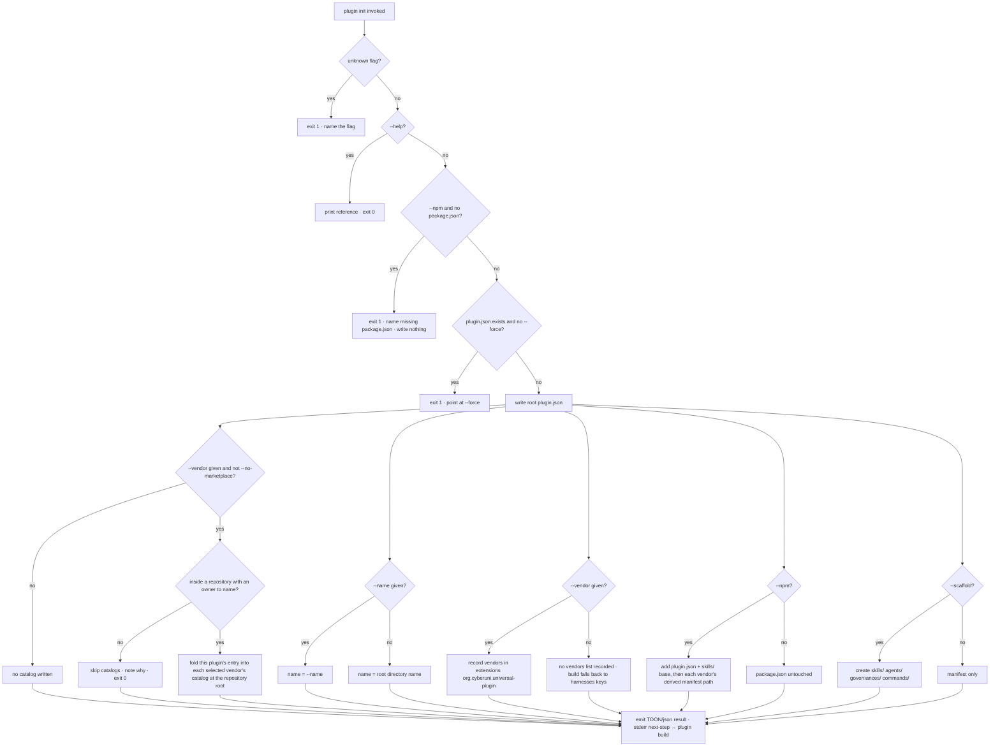

# plugin init — scaffold a plugin project, and wire an npm package to ship it

## What

`universal-plugin plugin init` sets up a plugin project: it writes the **canonical manifest** and,
on request, wires an npm package so the plugin's built artifacts travel with `npm publish`. It is the
entry point that produces the source-of-truth manifest the rest of the `plugin` group derives from.
Every command follows the AXI output contract ([../../axi/](../../axi/README.md)).

**Key terms**

- **Canonical manifest** — `plugin.json` at the project root, in Agent Plugins Specification v1.0.0
  form (ADR-0007). Its field set is **closed**: `$schema`, `name`, and the metadata fields, plus a
  single `extensions` object. Tool-specific data lives **only** under `extensions`, keyed by a
  reverse-domain namespace — `universal-plugin`'s own config lives at
  `extensions["org.cyberuni.universal-plugin"]`.
- **Derived vendor manifest** — a per-harness manifest `plugin build` generates from the canonical
  one, each at that harness's own path (e.g. `.claude-plugin/plugin.json` for Claude Code). These are
  build **outputs**, not authored here.
- **Local marketplace catalog** — the `marketplace.json` a repository carries so its plugins can be
  installed from the repository itself. It sits at the **repository** root, not the project root, and
  lists every plugin the repository develops, so it is named after the repository —
  `<owner>-<repo>-local` — and not after any one plugin. `marketplace init` owns generating one from
  the repository's plugins; `init` folds a single plugin's entry into it. Entry `version` is derived
  from the canonical manifest and never authored (ADR-0010 §3).
- **Ship on publish** — an npm package declares which files travel in its tarball via `package.json`
  `files`; `--npm` adds the **open-standard base** — the canonical root `plugin.json` and the skills
  directory — plus each selected vendor's derived manifest. The base is unconditional: the standard
  is the layer everything else sits on, not one target among several, so a package that shipped only
  `.claude-plugin/plugin.json` would have published a Claude Code plugin rather than a standard one.

> **Distribution caveat.** Claude Code's **npm** plugin source is **not supported for
> organization-distributed (Team / Enterprise) marketplaces** — those support only `github`, `url`,
> and `git-subdir` sources (org sync reads the marketplace repo through the Claude GitHub / GHE App).
> `--npm` wires the package regardless; the limitation is the *consumer's* (public / personal
> distribution, or the relative-path-in-marketplace-repo workaround). Recorded so an author is not
> surprised — see `## References`.

**Non-goals** — deriving the vendor manifests (`plugin build`); checking a manifest
(`plugin validate`); pinning release versions (`plugin bundle`); **setting a repository up to
*consume* skills** — the canonical skills layout, per-harness compatibility links, and the
enabled-harness record are **`repobuddy/buddy-agent-harness`**'s, withdrawn from this package
(ADR-0006); publishing to or installing from a marketplace (`cyberplace`).

> **Spec-first / impl-deferred.** No `init` command ships yet (`src/cli.ts` registers no `init`,
> there is no `src/init/` domain). This node is a contract; the impl gate withholds certification
> until it is built.

## Use Cases

The entry points, each a mode of the `universal-plugin plugin init` verb, given as
**trigger / inputs / outcome**:

- **Scaffold the canonical manifest** — `plugin init [--name <n>] [--vendor <id>]… [--scaffold]
  [--force] [--yes]`.
  - *trigger:* an author starts (or re-scaffolds) a plugin project.
  - *inputs:* the flags above; the project root (`--root`, else cwd).
  - *outcome:* a root `plugin.json` written with a `name` and the closed metadata shape; optionally
    the standard directories; each `--vendor` recorded in the build-target list. With **no** `--vendor`,
    no `vendors` list is written — `plugin build` then falls back to every `harnesses` key (its frozen
    `vendors ?? harnesses`-keys contract), so a fresh scaffold constrains nothing.
- **Wire an npm package to ship the plugin** — `plugin init --npm [--vendor <id>]… [--force]`.
  - *trigger:* an author wants the built vendor manifests to travel on `npm publish`.
  - *inputs:* an existing `package.json` at the root; the `--vendor` set (default `claude-code`).
  - *outcome:* the canonical manifest is written **and** `package.json` `files` carries the
    open-standard base (root `plugin.json` + the skills directory) plus each selected vendor's
    derived manifest path; existing `files` entries and other fields are preserved; safe to re-run.
- **Register the plugin in the repository's local marketplace** — `plugin init --vendor <id>…
  [--no-marketplace]`.
  - *trigger:* an author wants to install and test the plugin before publishing it.
  - *inputs:* the `--vendor` set; the repository the project root sits in.
  - *outcome:* each selected vendor's catalog at the **repository** root — `.claude-plugin/
    marketplace.json`, `.cursor-plugin/marketplace.json`, and the rest — carries an entry for this
    plugin, sourced at the path from the repository root to the project root. Catalogs already there
    keep their marketplace name, their owner, and every other plugin's entry; only this plugin's
    entry is re-derived. `--no-marketplace` skips the whole step, and so does an invocation with no
    `--vendor`.
- **Print the command reference** — `plugin init --help`.
  - *trigger:* an author asks what the verb does.
  - *inputs:* none.
  - *outcome:* a synopsis, the flags, and one example on stdout; exit 0.

## Control Flow

All three use cases enter one graph; `--npm` adds the pre-flight guard and the wiring step, `--help`
short-circuits. Decisions are nodes, branches are edges.

`init` never prompts, with or without `--yes` or `--format` — the "prompt?" decision is barred to
"no" on every path (AXI, ADR-0003). `--yes` is a compatibility no-op.

## Scenario map

Grouped by use case; 1:1 with [`init.feature`](./init.feature). `| Edge | Path (Given) | Scenario |`.

### Scaffold the canonical manifest

| Edge | Path (Given) | Scenario |
|---|---|---|
| write plugin.json | no manifest, defaults | `writes the canonical plugin.json with a name` |
| name = --name | `--name` given | `--name sets the plugin name` |
| name = dir | no `--name`, root named `cool-plugin` | `defaults the plugin name to the root directory name` |
| record vendors | `--vendor` given | `--vendor records the vendor in the universal-plugin extensions namespace` |
| no vendors list | no `--vendor` | `without --vendor no vendors list is recorded` |
| create dirs | `--scaffold` | `--scaffold creates the standard directories` |
| manifest only | no `--scaffold` | `without --scaffold only the manifest is written` |
| guard: exists | manifest exists, no `--force` | `an existing manifest fails pointing at --force` |
| overwrite | manifest exists, `--force` | `--force overwrites the existing manifest` |
| prompt barred (convergence) | any of default / `--yes` / `--format json` | `init never prompts on any invocation` |
| TOON result | success, no `--format` | `a successful run prints a TOON row per file plus the created aggregate` |
| JSON result | `--format json` | `--format json returns the created array` |
| next-step | success | `a successful run ends with the plugin build next-step line` |
| guard: unknown flag | `--frobnicate` | `an unknown flag fails loud` |

### Wire an npm package to ship the plugin

| Edge | Path (Given) | Scenario |
|---|---|---|
| wire default vendor | `--npm`, package.json present, no `--vendor` | `--npm defaults to wiring the claude-code manifest path` |
| wire each vendor | `--npm --vendor claude-code --vendor cursor` | `--npm wires each named vendor's derived manifest path` |
| wire standard base | `--npm` | `--npm wires the open-standard base into files` |
| base with one vendor | `--npm --vendor cursor` | `--npm wires the open-standard base even when a single vendor is named` |
| create files array | `--npm`, package.json without `files` | `--npm creates the files array when it is absent` |
| preserve others | `--npm`, package.json with `files` and `scripts` | `--npm preserves existing files entries and other fields` |
| idempotent re-run | `--npm --force` on already-wired package.json | `re-running --npm adds nothing new` |
| guard: no package.json | `--npm`, no package.json | `--npm with no package.json fails before writing the manifest` |
| barred: no --npm | package.json present, no `--npm` | `without --npm the package.json is untouched` |
| npm reports updated | `--npm` success | `--npm reports package.json as updated in the result` |

### Register the plugin in the repository's local marketplace

| Edge | Path (Given) | Scenario |
|---|---|---|
| catalog per vendor | `--vendor claude-code --vendor cursor` inside a repository | `--vendor writes each selected vendor's catalog at the repository root` |
| entry source | the project root is `packages/my-plugin` | `the catalog entry sources the plugin where it sits in the repository` |
| marketplace name | the repository has an `owner/repo` remote | `the marketplace is named after the repository and marked local` |
| existing catalog | a catalog at the repository root lists another plugin | `an existing catalog keeps its name, owner, and other plugins` |
| derived version | an existing entry carries a version the manifest does not | `an entry version the canonical manifest does not carry is removed` |
| converged re-run | the catalogs already carry this entry | `re-running init reports the catalogs unchanged` |
| barred: no vendor | no `--vendor` | `without --vendor no catalog is written` |
| opt out | `--no-marketplace --vendor claude-code` | `--no-marketplace writes no catalog` |
| no repository | the project root is not inside a repository | `outside a repository the catalogs are skipped with a note` |
| no owner | no author, no package author, no remote | `with no owner to name the catalogs are skipped with a note` |
| versionless Codex entry | `--vendor codex` on a manifest with no version | `the Codex catalog is written and its entry carries no version` |

### Print the command reference

| Edge | Path (Given) | Scenario |
|---|---|---|
| help | `--help` | `--help prints a concise reference` |

## References

- Agent Plugins Specification v1.0.0 (`agent-plugins.org`) — backs the closed `plugin.json` field set
  and the `extensions` reverse-domain namespace this node scaffolds. Adoption recorded in ADR-0007.
- ADR-0010 (this project) — backs the derived entry version: a catalog entry's version is copied
  from the manifest its `source` resolves to, never authored (§3), and repository-local catalogs are
  a derived artifact (§1).
- [Research: local marketplaces](../../../../../../.research/local-marketplaces/conclusion.md) —
  backs which catalog each runtime reads, and that `owner` is an object.
- ADR-0006 (this project) — backs the scope: `plugin init --npm` (the publish half) stays; the
  consume half moves to `repobuddy/buddy-agent-harness`.
- [Claude Code — Create and distribute a plugin marketplace](https://code.claude.com/docs/en/plugin-marketplaces)
  — backs the **Distribution caveat**: "Plugin sources of type `github`, `url`, and `git-subdir` are
  supported. `npm` and `archive` sources are not" for Team/Enterprise organization distribution
  (verified 2026-08-09).
