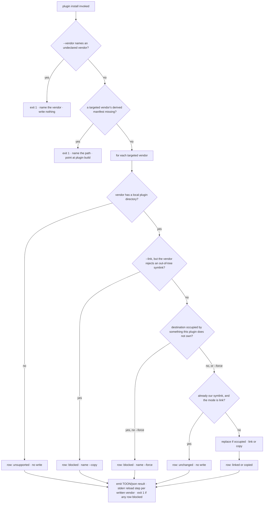
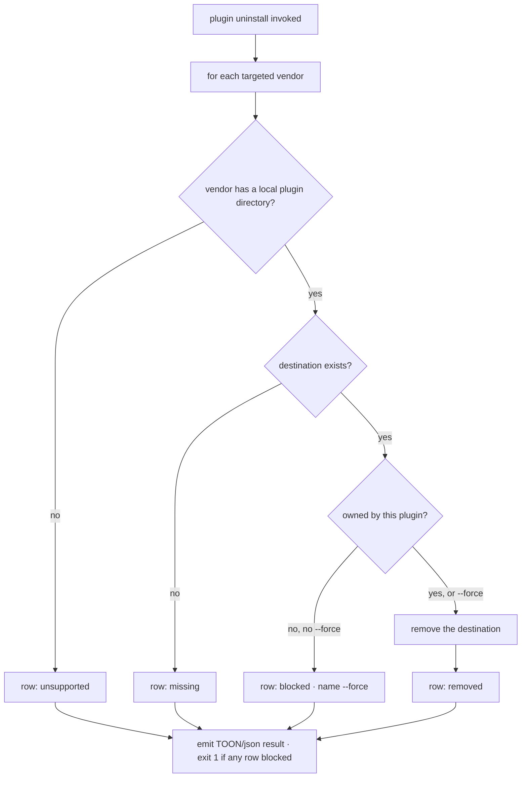

# plugin install / uninstall — put the working copy into a runtime, and take it back out

## What

`universal-plugin plugin install` installs **this** plugin — the one at the project root — into the
runtimes its own canonical manifest declares, for local development. `plugin uninstall` reverses it.
Both follow the AXI output contract ([../../axi/](../../axi/README.md)).

**Key terms**

- **Local plugin directory** — the directory a runtime scans for plugins under development, one
  entry per plugin. Claude Code scans its skills directory and loads what it finds as
  `<name>@skills-dir`; Cursor scans `~/.cursor/plugins/local/`. Codex and Copilot CLI scan none.
- **Destination** — `<local plugin directory>/<plugin name>`, where the name is the canonical
  manifest's `name`. One plugin, one destination per vendor.
- **Mode** — `link` (a symlink to the project root: the next edit is already installed) or `copy` (a
  snapshot of the tree, minus `.git` and `node_modules`, with symlinks dereferenced). The default is
  neither: it resolves per vendor from whether that vendor follows an out-of-tree symlink (ADR-0012
  §3).
- **Owned destination** — a destination this plugin put there: a symlink resolving to this project
  root, or a directory whose `plugin.json` carries this plugin's name. Only an owned destination is
  replaced or removed without `--force`.
- **Declared target set** — `plugin build`'s, unchanged: the manifest's explicit `vendors` list when
  present, else every `harnesses` key (ADR-0007). `--vendor` narrows it and never widens it.

**Non-goals** — installing a *published* plugin by name from a marketplace or registry (the runtime's
own job, and `cyberplace`'s); generating the repository-local catalog those installs read
(`marketplace init`); deriving the vendor manifests this command requires (`plugin build`);
reporting install state as a repository health check (`doctor`, ruled out in ADR-0012 §6).

## Use Cases

Given as **trigger / inputs / outcome**:

- **Install into every declared runtime** — `plugin install [--link|--copy] [--force]`.
  - *trigger:* an author wants the plugin they are editing loaded by the runtimes they target.
  - *inputs:* the canonical manifest's name and target set; each vendor's local-install facts from
    the vendor registry; whatever occupies each destination; the project root (`--root`, else cwd).
  - *outcome:* each supported vendor's destination holds this plugin, linked or copied; each vendor
    with no local plugin directory is reported `unsupported`; stderr names the reload step every
    written vendor now needs.
- **Install into one runtime** — `plugin install --vendor <id>…`.
  - *trigger:* an author works against a single runtime.
  - *inputs:* as above, narrowed to the named vendors.
  - *outcome:* as above for those vendors only; a vendor the manifest does not declare fails the run.
- **See where it would go** — `plugin install --list`.
  - *trigger:* an author asks where this would land before it lands.
  - *inputs:* as above.
  - *outcome:* the resolved rows and destination paths on stdout; nothing is written.
- **Remove the install** — `plugin uninstall [--vendor <id>…] [--force] [--list]`.
  - *trigger:* an author is done, or is switching to a published build.
  - *inputs:* as above; no derived manifest is required.
  - *outcome:* every owned destination removed; an absent one reported `missing`, not an error; an
    unowned one refused unless `--force`.
- **Print the command reference** — `plugin install --help` / `plugin uninstall --help`.
  - *trigger:* an author asks what the verb does.
  - *outcome:* a synopsis, the flags, and one example on stdout; exit 0.

## Control Flow

One graph per verb. Decisions are nodes, branches are edges.

`--list` short-circuits every write and every removal; it changes no row and no exit code.

## Scenario map

Grouped by use case; 1:1 with [`install.feature`](./install.feature).
`| Edge | Path (Given) | Scenario |`.

### Install into every declared runtime

| Edge | Path (Given) | Scenario |
|---|---|---|
| link | vendor follows an out-of-tree symlink | `links the project root into a vendor that follows a symlink` |
| copy | vendor rejects an out-of-tree symlink | `copies into a vendor that rejects an out-of-tree symlink` |
| copy excludes | the root carries `.git` and `node_modules` | `a copy leaves node_modules and .git behind` |
| default target set | no `--vendor` | `installs into every vendor the manifest declares` |
| unsupported | vendor with no local plugin directory | `a vendor with no local plugin directory is reported, not failed` |
| forced copy | `--copy` against a linking vendor | `--copy snapshots even where a symlink would load` |
| forced link | `--link` against a rejecting vendor | `--link fails a vendor that will not load one, naming --copy` |
| reload note | any write | `the run names the reload step each written vendor now needs` |
| idempotent | destination is our symlink | `re-running changes nothing and stays green` |
| replace ours | destination is our earlier copy | `an earlier install of this plugin is replaced, not stacked` |
| guard: occupied | destination holds another plugin | `a destination this plugin does not own is refused and left alone` |
| override | same, with `--force` | `--force replaces a destination this plugin does not own` |
| guard: unbuilt | a targeted vendor's derived manifest is missing | `a missing derived manifest fails the run, naming plugin build` |
| guard: undeclared | `--vendor` names a vendor the manifest does not declare | `an undeclared vendor fails the run` |
| TOON result | success, no `--format` | `a successful run prints a TOON row per vendor plus the aggregate` |
| JSON result | `--format json` | `--format json returns the rows and the summary` |

### See where it would go

| Edge | Path (Given) | Scenario |
|---|---|---|
| list | `--list` | `--list resolves the destinations without writing` |

### Remove the install

| Edge | Path (Given) | Scenario |
|---|---|---|
| remove link | installed by link | `uninstall removes what install put there` |
| remove copy | installed by copy | `uninstall removes a copied install` |
| missing | never installed | `uninstalling twice reports the destination as missing` |
| guard: not ours | destination holds another plugin | `uninstall never removes another plugin` |
| override | same, with `--force` | `--force removes a destination this plugin does not own` |
| no manifest needed | derived manifests absent | `uninstall does not require a derived manifest` |
| list | `--list` | `uninstall --list removes nothing` |

### Print the command reference

| Edge | Path (Given) | Scenario |
|---|---|---|
| help | `--help` | `--help prints a concise reference` |

## References

- ADR-0012 (this project) — the decisions this node specifies: the local-only scope, the registry as
  the home of the destination, the per-vendor mode, the ownership rule, and the build guard.
- ADR-0007 (this project) — the declared target set (`vendors ?? harnesses` keys) reused here.
- `.research/local-marketplaces/` — the verified local-install facts behind the registry's values,
  with the confidence attached to each.
