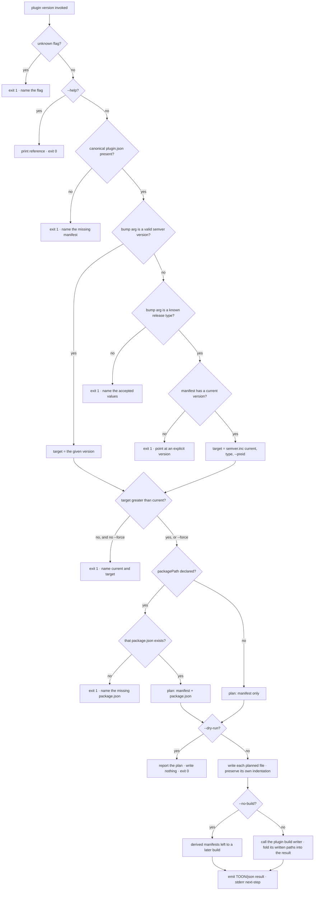

# plugin version — move the plugin's version, and keep every version-carrying file in sync

## What

`universal-plugin plugin version` moves a plugin's version. It writes the **authored** numbers — the
canonical manifest and, when the project declares one, the npm `package.json` beside it — and then
**re-derives** the vendor manifests through `plugin build`'s own writer, so nothing that carries a
version is left behind by the bump. Every command follows the AXI output contract
([../../axi/](../../axi/README.md)).

**Key terms**

- **Authored version** — a version a human (or a release tool) writes by hand. There are exactly two:
  the canonical `plugin.json` `version` field, which is the plugin's source of truth (ADR-0007), and
  the `version` in the `package.json` at the project's declared `packagePath`, which is npm's own
  number. Nothing else on disk is authored.
- **Derived version** — a version some command copies out of an authored one. The per-vendor
  manifests (`plugin build`), the repository-local marketplace catalogs (`marketplace init`), and the
  `npx`/`upx <cli>@<version>` pins inside `skills/**/SKILL.md` (`plugin bundle`) are all derived.
- **`packagePath`** — the CLI's own config key in `.agents/universal-plugin.json`, naming the
  directory holding the npm package that ships this plugin. Already read by `publish sync-version`.
  Absent when the plugin is not published to npm.
- **Bump argument** — either a semver **release type** (`major`, `minor`, `patch`, `premajor`,
  `preminor`, `prepatch`, `prerelease`), which is applied to the current version, or an **explicit
  version** (`1.4.0`), which is used as given.

**Why the verb does not write the derived files.** A version bump touching
`.claude-plugin/plugin.json` directly would be a second writer for a file `plugin build` already
owns, with its own idea of the derivation rules — the two would drift on the first change to either.
So this node re-derives by **calling `build`**, not by re-implementing it. `--no-build` opts out for
callers that drive `build` themselves.

**Why the two authored numbers move together.** They are the same release. A bump that moved only
the manifest would leave the npm tarball claiming a version the plugin inside it does not have, and
`publish sync-version` exists precisely to repair that drift after the fact. Moving both here means
there is nothing to repair.

**Non-goals** — deciding *which* number is authoritative for a repo, and whether a marketplace
source should resolve a tag rather than a branch (that is version **policy**, tracked separately);
warning that manifest content changed without a version bump; deriving the vendor manifests
(`plugin build`); pinning skill references (`plugin bundle`); publishing to npm or to a marketplace
(`cyberplace`).

## Relationship to `npm version`, changesets, and `publish sync-version`

- **`npm version`** knows only `package.json`. Run against a plugin it moves the number that is *not*
  the source of truth and leaves the canonical manifest — and every derived artifact — stale. It is
  not a substitute for this verb.
- **changesets** owns package versions in a workspace, and repos that use it (including this one)
  want the number decided there. That direction already exists: `publish sync-version` copies
  `<packagePath>/package.json` → canonical `plugin.json`, and this repo's root `version` script runs
  it right after `changeset version`.
- The two directions differ **only in where the new number comes from** — computed here, read from
  `package.json` there. They therefore share **one applier**: the code that writes a resolved version
  into the authored files is the same in both paths, so they cannot drift. `sync-version`'s own
  observable behavior is unchanged — it re-derives nothing, because its caller is a release script
  that already drives `build` itself (this repo's root `plugin:build` script does exactly that).

Stated as a rule for authors: **if your repo uses changesets, keep using it** and let
`publish sync-version` carry the number into the manifest. **If it does not**, `plugin version` is
the whole release-number step.

## The skill question

A verb in this package is asked two separate questions about a companion skill, and they have
different answers here. **Judgment: none to encode. Reach: needed, and shipped as a route on the
existing gateway skill rather than a new one.**

**Judgment — nothing to encode.** ADR-0005 §3's bar is that an interactive front-end ships as a
skill because the CLI is non-interactive by construction. This verb has no interactive step: once
the release type is named, the new version, the set of files to write, and the re-derivation are all
determined by `semver.inc` and the existing `build` writer, and the guards reject every ambiguous
input rather than guessing at one. The one genuinely judged step — *which* release type a change
deserves — is deliberately not this verb's. It is a changelog-authoring decision, the ecosystem
answer for it (changesets) is already in this repo, and it already composes with the verb through
`publish sync-version`.

**Reach — not covered before this node, and judgment is the wrong axis to settle it on.** A verb
nobody can find ships unreachable however little judgment it needs. Measured:

- `plugin init --npm` wires `package.json` `files` and nothing else — it adds no dependency, no
  script, and no pin, so a scaffolded plugin repo does **not** have this CLI installed.
- The package is published, so the verb is reachable with no install as
  `npx universal-plugin plugin version <bump>` — that is the same unpinned invocation the gateway
  skill already uses for `governance show`.
- The gateway skill `plugin` is this package's discoverability surface for exactly this class of
  ask, and its route table covered create / adopt / inspect / update / delete. **None of them is
  "move the version"**, and `update.md` is scoped to what a plugin *declares* — vendors and
  components — not to what it releases under. An agent asked to bump a plugin's version would have
  found no route and hand-edited a `version` field, which is precisely the drift this verb exists to
  prevent.

So the reach surface is required, and it is **`skills/plugin/references/version.md`** plus its route
row — not a new top-level skill. A separate skill would compete with the gateway for triggering on
the same asks and fragment the route table the gateway exists to be; the gateway already claims
"updating … a universal agent plugin" and now names the version triggers explicitly. This is still
ADR-0005 §3's "ships with the verb", delivered as a route rather than a new skill.

Recorded so a later reader does not re-open either half: the missing standalone skill is a decision,
and the reach it would have carried is covered by the gateway route.

## Use Cases

The entry points, each a mode of the `universal-plugin plugin version` verb, given as
**trigger / inputs / outcome**:

- **Bump by release type** — `plugin version <major|minor|patch|premajor|preminor|prepatch|prerelease>
  [--preid <id>] [--no-build] [--dry-run]`.
  - *trigger:* an author is cutting a release and knows its class.
  - *inputs:* the release type; the canonical manifest's current `version`; the project root
    (`--root`, else cwd); `packagePath` from `.agents/universal-plugin.json` when present.
  - *outcome:* the canonical `plugin.json` and — when `packagePath` is declared — that
    `package.json` both carry the incremented version; the vendor manifests are re-derived through
    `plugin build` unless `--no-build`; each written file is reported.
- **Set an explicit version** — `plugin version <x.y.z> [--force] [--no-build] [--dry-run]`.
  - *trigger:* an author knows the exact number (a first release, a coordinated version, a correction).
  - *inputs:* the version literal; the same root and config as above.
  - *outcome:* the same writes, with the version used as given. A manifest carrying no `version` yet
    is seeded this way; a version that does not advance on the current one is refused without
    `--force`.
- **Print the command reference** — `plugin version --help`.
  - *trigger:* an author asks what the verb does.
  - *inputs:* none.
  - *outcome:* a synopsis, the flags, the accepted release types, and one example on stdout; exit 0.

## Control Flow

All three use cases enter one graph. Every guard resolves **before** the first write, so a failing
run leaves the tree untouched. Decisions are nodes, branches are edges.

A run never prompts — the "prompt?" decision is barred to "no" on every path (AXI, ADR-0003).

## Scenario map

Grouped by concern; 1:1 with [`version.feature`](./version.feature).
`| Edge | Path (Given) | Scenario |`.

### Move the authored version

| Edge | Path (Given) | Scenario |
|---|---|---|
| inc patch | manifest at `1.2.3`, `patch` | `a patch bump moves the canonical manifest version` |
| inc minor | manifest at `1.2.3`, `minor` | `a minor bump zeroes the patch component` |
| inc major | manifest at `1.2.3`, `major` | `a major bump zeroes the minor and patch components` |
| exact | manifest at `1.2.3`, `2.0.0-rc.1` | `an explicit version is used exactly as given` |
| preid | manifest at `1.2.3`, `prerelease --preid beta` | `--preid names the prerelease identifier` |
| prerelease increment | manifest at `1.2.4-beta.0`, `prerelease` | `a prerelease bump increments the existing identifier` |
| seed | manifest with no `version`, explicit `0.1.0` | `an explicit version seeds a manifest that has none` |
| preserve fields | manifest with `name` and `description` | `every other manifest field is preserved` |
| preserve indent | manifest indented with two spaces | `the canonical manifest keeps its own indentation` |

### Keep the npm package.json in lockstep

| Edge | Path (Given) | Scenario |
|---|---|---|
| write package.json | `packagePath` declared, package.json present | `the packagePath package.json moves to the same version` |
| preserve package fields | that package.json has `name` and `scripts` | `the package.json keeps its other fields and its own indentation` |
| no packagePath | no `.agents/universal-plugin.json` | `without a declared packagePath only the manifest is written` |
| report both | `packagePath` declared | `both authored files are reported as updated` |

### Re-derive the vendor manifests

| Edge | Path (Given) | Scenario |
|---|---|---|
| derive | manifest declaring a `claude-code` harness | `the derived vendor manifest carries the new version` |
| opt out | same, `--no-build` | `--no-build leaves the derived manifests untouched` |
| nothing to derive | manifest declaring no harnesses | `a plugin with no declared harnesses still bumps` |

### Guards

| Edge | Path (Given) | Scenario |
|---|---|---|
| guard: no manifest | empty root | `a missing canonical manifest fails loud` |
| guard: no current | manifest with no `version`, `patch` | `a release type with no current version points at an explicit version` |
| guard: bad arg | `frobnicate` | `an unrecognized bump argument names the accepted values` |
| guard: not greater | manifest at `1.2.3`, explicit `1.0.0` | `a version that does not advance is refused` |
| force downgrade | manifest at `1.2.3`, explicit `1.0.0`, `--force` | `--force allows a version that does not advance` |
| guard: missing package.json | `packagePath` declared, no package.json there | `a declared packagePath with no package.json fails before any write` |
| guard: writes nothing | any failing guard | `a failing guard leaves every file untouched` |
| dry run | `--dry-run` | `--dry-run reports the plan and writes nothing` |
| guard: unknown flag | `--frobnicate` | `an unknown flag fails loud` |

### AXI output contract

| Edge | Path (Given) | Scenario |
|---|---|---|
| TOON result | success, no `--format` | `a successful run prints a row per written file plus the updated aggregate` |
| JSON result | `--format json` | `--format json returns the from, to, and written fields` |
| next-step | success | `a successful run ends with a next-step line` |

### Print the command reference

| Edge | Path (Given) | Scenario |
|---|---|---|
| help | `--help` | `--help prints a concise reference` |

## References

- Agent Plugins Specification v1.0.0 (`agent-plugins.org`) — backs the canonical root `plugin.json`
  as the plugin's version source of truth. Adoption recorded in ADR-0007.
- ADR-0006 (this project) — the shared-object charter test this node passes: its object **is** the
  canonical manifest.
- ADR-0005 §3 (this project) — the bar the skill question above is answered against.
- [`plugin/build/`](../build/README.md) — the writer this node calls to re-derive; the reason the
  derived manifests are not written here.
